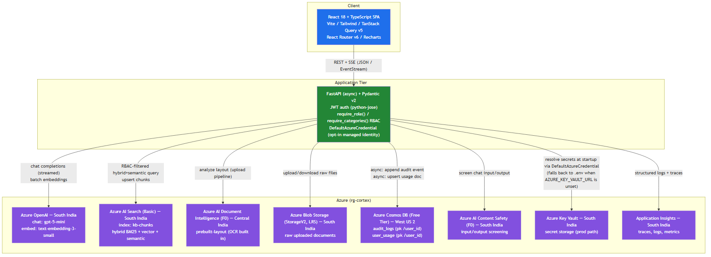

# Cortex: AI Enterprise Knowledge Assistant

A full-stack Retrieval-Augmented Generation (RAG) application for enterprise knowledge search
and Q&A, with role-based access control (RBAC), an append-only audit trail, and per-user token
usage/cost tracking — built end-to-end on Azure.

## Table of Contents

- [Overview](#overview)
- [Architecture](#architecture)
- [RBAC Design](#rbac-design)
- [Audit Model](#audit-model)
- [Token Tracking](#token-tracking)
- [Azure Provisioning Guide](#azure-provisioning-guide)
- [API Table](#api-table)
- [Setup & Run](#setup--run)
- [Bonus Features](#bonus-features)
- [Known Limitations & Production Roadmap](#known-limitations--production-roadmap)

---

## Overview

Cortex lets employees upload internal documents (policies, financial reports, engineering
specs, etc.) and ask natural-language questions against them, with answers grounded in — and
cited to — the actual source content. Every document is tagged with a category, and every user
has a role that determines which categories they're allowed to search and chat over. All
significant actions (logins, uploads, deletes, chat queries, safety flags, access denials, admin
actions) are written to an append-only audit log, and every chat query's token usage is tracked
per user, per day, with cost estimated against configurable per-1K-token rates.

**Stack**

| Layer | Technology |
|---|---|
| Backend | FastAPI (async), Pydantic v2, Python |
| Frontend | React 18, TypeScript (strict), Vite, Tailwind CSS, TanStack Query v5, React Router v6, Recharts |
| LLM / Embeddings | Azure OpenAI — `gpt-5-mini` (chat), `text-embedding-3-small` (embeddings) |
| Retrieval | Azure AI Search (hybrid BM25 + vector + semantic ranking) |
| Document parsing | Azure AI Document Intelligence (`prebuilt-layout`, OCR included) |
| Storage | Azure Blob Storage |
| Audit / usage data | Azure Cosmos DB |
| Content moderation | Azure AI Content Safety |
| Secrets | Azure Key Vault (opt-in via `AZURE_KEY_VAULT_URL`; falls back to `.env`) + optional managed identity |
| Observability | Application Insights |

---

## Architecture

The application is a classic three-tier RAG system: a React SPA talks exclusively to a single
FastAPI backend, which is the only component that talks to Azure. The backend never lets the
frontend or the LLM touch Azure resources directly — every Azure call (search, embeddings, chat
completion, blob read/write, Cosmos read/write, content safety, secrets) is mediated by FastAPI,
which is also where the RBAC and audit enforcement live.

At a glance:

1. **Document ingestion:** a user uploads a file -> FastAPI stores the raw file in **Blob
   Storage** -> **Document Intelligence** (`prebuilt-layout`) extracts text, layout, and tables
   (OCR is automatic for scanned/image content, no separate OCR step needed) -> the backend
   chunks the extracted content using heading-based semantic chunking with a sliding-window
   fallback (~800 tokens, 15% overlap; tables are serialized as markdown so the LLM can read them
   later) -> each chunk is embedded in batch via **`text-embedding-3-small`** -> chunks + vectors
   + metadata (including `document_category`) are upserted into the **`kb-chunks`** index in
   **Azure AI Search**.
2. **Chat:** a user's question first passes through **Content Safety** -> FastAPI builds an
   Azure AI Search `$filter` from the caller's RBAC-allowed categories and runs a hybrid
   (BM25 + vector) + semantic search, top-5 -> the retrieved chunks are assembled into a grounded
   prompt that requires the model to cite sources as `[n]` and to say *"I don't have enough
   information to answer that."* when the retrieved context is insufficient -> **`gpt-5-mini`**
   streams the answer back over Server-Sent Events (SSE) with `stream_options.include_usage` so
   token counts arrive with the stream -> the completed answer is screened again by **Content
   Safety** before the final SSE event ships citations + token usage to the client -> the
   `chat_query` audit event and the day's `user_usage` aggregate are written to **Cosmos DB** as
   background tasks (i.e., after the response has already been sent, so this never adds latency
   to the user-visible chat stream).
3. **Everything else** (auth, RBAC checks, admin document management, usage/audit dashboards) is
   plain FastAPI CRUD backed by Cosmos DB and Azure AI Search, secured by the JWT issued at login.

Every request/response body across the API is a Pydantic v2 model (see `app/schemas/`) — nothing
is passed around as an untyped dict past the service boundary. Structured JSON logs go through
`structlog` everywhere in `app/` (not stdlib `logging` directly), and every synchronous Azure/
OpenAI SDK call that can be throttled (`_embed_query_sync`, `_run_search_sync`,
`_run_document_intelligence`, `_create_embeddings_batch`, `_create_chat_stream`, Content Safety's
`_analyze_sync`) is wrapped in `core/retry.py`'s exponential-backoff decorator, which retries on
HTTP 429 only and re-raises everything else immediately.



The diagram above is rendered from a version-controlled **Mermaid flowchart** in
[`docs/architecture.md`](docs/architecture.md) (also viewable natively in GitHub/GitLab/Azure
DevOps Markdown previews) — a pragmatic substitute for hand-drawing the same thing in
draw.io/Excalidraw, since the source stays diffable in code review and `architecture.png` is
just its rendered output (regenerate with `npx @mermaid-js/mermaid-cli -i docs/architecture.md
-o architecture.png` after editing the source). See that file for the full legend and
request-flow notes.

---

## RBAC Design

There are 5 document categories: `general`, `finance`, `hr`, `legal`, `engineering`. There are 3
roles, each mapped to a fixed set of allowed categories:

| Role | Allowed categories |
|---|---|
| `admin` | `general`, `finance`, `hr`, `legal`, `engineering` (all 5) |
| `analyst` | `general`, `finance` |
| `viewer` | `general` |

RBAC is enforced at **three independent layers**, so a bug in any one layer doesn't expose
restricted content:

1. **FastAPI dependencies (`require_role()` and `require_categories()`)** — every protected route
   declares which roles may call it via `require_role()`. Endpoints that additionally accept a
   caller-supplied category at request time (document upload, re-categorize) are also gated by
   `require_categories()`, which reads the category from the request and denies (`403`) if it
   isn't one of the caller's role-derived allowed categories. Either dependency writes a
   `rbac_denial` audit event on denial (see [Audit Model](#audit-model)).
2. **Azure AI Search `$filter`** — for retrieval, the backend never asks the search index for
   "everything" and filters client-side. Instead it builds an OData `$filter` on the
   `document_category` field directly from the caller's role-derived category list, so a
   `viewer` calling `/chat` cannot retrieve `finance`/`hr`/`legal`/`engineering` chunks even if
   there were an application bug elsewhere — the restricted chunks are never returned by Azure AI
   Search, and therefore **never reach the LLM prompt at all**. This is the most important layer:
   it prevents data leakage at the retrieval boundary, not just at the API boundary.
3. **React `<RoleGuard>` + conditional navigation** — the frontend also hides routes and nav
   items the current role can't use (`<RoleGuard>` wraps protected routes; the nav bar
   conditionally renders admin-only or analyst+ links). This is a UX layer only — it improves the
   experience by not showing dead-end links, but it is **not** a security boundary; layers 1 and 2
   are what actually protect data.

---

## Audit Model

Every security- or activity-relevant action is written to Cosmos DB container **`audit_logs`**
(partition key **`/user_id`**). The container is **append-only by construction** — there is no
update or delete code path anywhere in the backend for this container (no `PATCH`/`DELETE`
handler touches audit documents, and no admin UI action can mutate a past entry). That absence of
a mutation path *is* the tamper-evidence story for this build: nothing in the running application
can rewrite history, so the log is only ever appended to.

**Event types:**

| Event type | Written when |
|---|---|
| `login` | A demo user successfully authenticates |
| `logout` | A user ends their session |
| `document_upload` | Written at **every** ingestion stage transition for a document — `extracting`, `chunking`, `indexing`, and finally `ready`/`failed` — not just once at completion |
| `document_delete` | A document is removed from the index/store |
| `chat_query` | A chat request completes (includes retrieved citations context) |
| `content_safety_flag` | Content Safety flags chat input or output |
| `rbac_denial` | `require_role()` or `require_categories()` rejects a request with 403 |
| `admin_action` | An admin performs a privileged action (e.g. deleting another user's doc) |

**Representative document shape** (fields vary slightly by `event_type`):

```json
{
  "id": "b3f1c2a4-...-uuid",
  "user_id": "user-arjun-001",
  "email": "analyst.arjun@demo.cortex",
  "role": "analyst",
  "session_id": "sess-...-uuid",
  "event_type": "chat_query",
  "timestamp": "2026-07-04T09:12:31.482Z",
  "detail": {
    "query": "What is the Q3 revenue?",
    "categories_searched": ["general", "finance"],
    "citations": [1, 2],
    "prompt_tokens": 812,
    "completion_tokens": 143
  },
  "ip_address": "10.0.0.4"
}
```

`/audit` (list/query, admin-only) and `/audit/export` (CSV/JSON export, admin-only) read from
this container; nothing in the API surface writes anything other than a brand-new document.

---

## Token Tracking

Every chat completion returns token usage via the OpenAI-compatible streaming
`stream_options: { include_usage: true }` payload, captured on the final SSE chunk. Usage is
persisted to Cosmos DB container **`user_usage`** (partition key **`/user_id`**), with **one
document per user per calendar day**, upserted/incremented on every query that day:

```json
{
  "id": "user-arjun-001_2026-07-04",
  "user_id": "user-arjun-001",
  "date": "2026-07-04",
  "prompt_tokens": 4820,
  "completion_tokens": 1190,
  "embedding_tokens": 0,
  "query_count": 6
}
```

**`embedding_tokens`** is tracked separately from chat tokens and populated from **two** sources:
the batch embedding calls made during document ingestion (chunking -> embed -> index), and the
single query-embedding call made on every `/chat` request before retrieval. Both paths read the
`usage.total_tokens` field off the real OpenAI embeddings response and feed it into the same
`increment_usage()` call as prompt/completion tokens, so a user's daily total reflects the true
cost of everything they triggered, not just chat completions.

**Aggregation** happens at query time (not via a separate rollup job): `GET /usage/me` and
`GET /usage/all` (admin-only) sum the relevant date-partitioned documents on the fly for
`today` / `this week` / `this month` / `all-time` windows. `GET /usage/all/{user_id}` gives an
admin the same breakdown plus a 30-day daily history for one specific user (the Admin Usage
Analytics leaderboard's drill-down).

**Cost estimation** multiplies aggregated token counts by configurable `$` per 1,000 token rates
read from `.env` (`COST_PER_1K_PROMPT_TOKENS`, `COST_PER_1K_COMPLETION_TOKENS`,
`COST_PER_1K_EMBEDDING_TOKENS`), so the displayed dollar figures can be kept in sync with actual
negotiated Azure OpenAI pricing without a code change. `GET /usage/export` produces a
CSV/JSON export of the same aggregates for offline reporting.

### Token quotas (§7.3)

Per-role daily token quotas are configurable via `.env`
(`DAILY_TOKEN_QUOTA_ADMIN`/`_ANALYST`/`_VIEWER`, each `int` or blank for unlimited — admin
defaults to unlimited, analyst to 50,000/day, viewer to 20,000/day). `GET /usage/me` returns the
caller's current `quota` object (`limit`, `used`, `remaining`, `percent_used`, `exceeded`); the
My Usage page renders it as a progress bar that turns amber past 80% usage
(`QUOTA_WARNING_THRESHOLD_PCT`) and red once exceeded. When a user's daily quota is exceeded,
`/chat` returns a friendly fallback message over the same SSE contract (`quota_exceeded: true` in
the final event) **without calling Azure OpenAI at all** — the check runs immediately after
content-safety screening and before retrieval or generation, so an exhausted quota costs nothing
further. Quotas are per-role only, not per-user; see [Known
Limitations](#known-limitations--production-roadmap) for the per-user admin-override roadmap.

---

## Azure Provisioning Guide

All resources live in a single resource group, **`rg-cortex`**. Eight Azure resources are
provisioned in total. **Six of the eight sit in South India**; two are intentionally elsewhere —
see the callout after the commands.

> Replace ALL_CAPS placeholders (names, passwords) with your own values. Names shown are
> examples; Azure resource names for Storage/Cosmos/Search/OpenAI/CognitiveServices must be
> globally unique, so you will likely need to suffix them.

```bash
# 0. Login + resource group
az login
az group create \
  --name rg-cortex \
  --location southindia

# 1. Azure OpenAI — South India
#    Chat deployment: gpt-5-mini (see substitution note below)
#    Embedding deployment: text-embedding-3-small
az cognitiveservices account create \
  --name cortex-openai \
  --resource-group rg-cortex \
  --location southindia \
  --kind OpenAI \
  --sku S0 \
  --custom-domain cortex-openai

az cognitiveservices account deployment create \
  --name cortex-openai \
  --resource-group rg-cortex \
  --deployment-name gpt-5-mini \
  --model-name gpt-5-mini \
  --model-version "1" \
  --model-format OpenAI \
  --sku-capacity 10 \
  --sku-name Standard

az cognitiveservices account deployment create \
  --name cortex-openai \
  --resource-group rg-cortex \
  --deployment-name text-embedding-3-small \
  --model-name text-embedding-3-small \
  --model-version "1" \
  --model-format OpenAI \
  --sku-capacity 10 \
  --sku-name Standard

# 2. Azure AI Search — South India (Basic tier, index created separately via script)
az search service create \
  --name cortex-search \
  --resource-group rg-cortex \
  --location southindia \
  --sku Basic

# 3. Azure AI Document Intelligence — Central India (see region note below)
az cognitiveservices account create \
  --name cortex-docintel \
  --resource-group rg-cortex \
  --location centralindia \
  --kind FormRecognizer \
  --sku F0

# 4. Azure Blob Storage — South India
az storage account create \
  --name cortexstorage \
  --resource-group rg-cortex \
  --location southindia \
  --sku Standard_LRS \
  --kind StorageV2

az storage container create \
  --account-name cortexstorage \
  --name documents

# 5. Azure Cosmos DB (free tier) — West US 2 (see region note below)
az cosmosdb create \
  --name cortex-cosmos \
  --resource-group rg-cortex \
  --locations regionName=westus2 failoverPriority=0 \
  --enable-free-tier true \
  --default-consistency-level Session

az cosmosdb sql database create \
  --account-name cortex-cosmos \
  --resource-group rg-cortex \
  --name cortex

az cosmosdb sql container create \
  --account-name cortex-cosmos \
  --resource-group rg-cortex \
  --database-name cortex \
  --name audit_logs \
  --partition-key-path /user_id \
  --throughput 400

az cosmosdb sql container create \
  --account-name cortex-cosmos \
  --resource-group rg-cortex \
  --database-name cortex \
  --name user_usage \
  --partition-key-path /user_id \
  --throughput 400

# 6. Azure AI Content Safety — South India
az cognitiveservices account create \
  --name cortex-contentsafety \
  --resource-group rg-cortex \
  --location southindia \
  --kind ContentSafety \
  --sku F0

# 7. Azure Key Vault — South India
az keyvault create \
  --name cortex-kv \
  --resource-group rg-cortex \
  --location southindia

# 8. Application Insights — South India
az monitor app-insights component create \
  --app cortex-appinsights \
  --resource-group rg-cortex \
  --location southindia \
  --kind web \
  --application-type web
```

### Why two resources are outside South India

- **Document Intelligence -> Central India.** South India does not support the
  `FormRecognizer` resource kind at all (`az cognitiveservices account create --kind
  FormRecognizer --location southindia` fails outright — there's no SKU/version to fall back
  to in-region). Central India is the nearest region that supports it. This is a single REST
  endpoint the backend calls over HTTPS, so being in a different region from the rest of the
  stack has no architectural consequence beyond a few extra milliseconds on document upload
  (an infrequent, non-latency-sensitive operation).
- **Cosmos DB -> West US 2.** Free-tier Cosmos DB account creation in **both** South India and
  East US repeatedly failed with `ServiceUnavailable` ("this region is currently experiencing
  high demand for free tier accounts") at build time. West US 2 was the first region that
  succeeded. Because both audit-log writes and usage-aggregate writes happen as **background
  tasks** *after* the user-facing response has already been sent (see [Audit
  Model](#audit-model) / [Token Tracking](#token-tracking)), the added cross-region latency
  (South India compute -> West US 2 data) is invisible to the end user — it only affects how
  quickly a write lands in Cosmos, never how quickly a chat answer streams back.
- **Embeddings (`text-embedding-3-small`) -> a second Azure OpenAI/AI Services resource in East
  US 2.** The South India OpenAI resource (`cortex-openai-uc1`) has **zero quota** for this
  model's SKU on this trial subscription — `az cognitiveservices account deployment create`
  fails with `InsufficientQuota` at any capacity (1, 30) and any SKU (`Standard`,
  `GlobalStandard`). A second resource with a working embedding deployment already existed
  (created while requesting a quota increase), so the backend points embedding calls at it via
  two dedicated settings, `AZURE_OPENAI_EMBEDDING_ENDPOINT` / `AZURE_OPENAI_EMBEDDING_API_KEY`
  in `.env` (see `app/core/azure_clients.py::get_embedding_client()`), while chat completions
  still go to the primary South India resource. Both ingestion (chunk embedding) and chat (query
  embedding) use this second client. Production fix: request an embedding-model quota increase
  for the South India resource and drop back to a single resource once granted.

### gpt-4o -> gpt-5-mini substitution (documented, deliberate)

The original spec called for **gpt-4o**. By build time, Azure OpenAI had fully deprecated
gpt-4o for **new deployments** in the target subscription/region — no version of it was
deployable. **`gpt-5-mini`** was substituted as the cheapest generally-available model well
suited to grounded RAG answering (strong instruction-following for citation formatting and
"insufficient context" refusals, at a fraction of the cost of larger models). This is not a
silent downgrade: cost-per-1K-token settings in `.env` and this README both name the model
explicitly, and it's called out again in [Known Limitations](#known-limitations--production-roadmap).

### Declarative alternative: Bicep

The `az cli` commands above are also expressed as a Bicep template in
[`infra/main.bicep`](infra/main.bicep) (validated with `az bicep build`), for one-shot
provisioning instead of running each command by hand — see [`infra/README.md`](infra/README.md)
for deploy instructions. It provisions the same 8 resources with the same names/SKUs/regions;
the Search index schema and resource keys still need the same one-time follow-up steps either way.

### One-time index setup

After provisioning Azure AI Search, run the index-creation script once (see [Setup &
Run](#setup--run)) to create the `kb-chunks` index with its vector, BM25, and semantic
configuration — the `az search service create` command above only provisions the *service*, not
the index schema.

---

## API Table

| Method | Path | Roles allowed | Description |
|---|---|---|---|
| `POST` | `/auth/login` | Public (any of the 3 demo users) | Issues a JWT for one of the 3 simulated demo users (Admin Aisha, Analyst Arjun, Viewer Vik) |
| `GET` | `/auth/me` | Any authenticated user | Returns the decoded claims of the caller's current session |
| `POST` | `/auth/logout` | Any authenticated user | Ends the session; writes a `logout` audit event |
| `POST` | `/documents` | `admin`, `analyst` (+ `require_categories()`: only to their own allowed categories) | Uploads a document; runs the full ingestion pipeline (Blob -> Document Intelligence -> chunk -> embed -> index), with a `document_upload` audit event at every stage transition |
| `GET` | `/documents` | Any authenticated user | Lists documents visible to the caller, filtered to their RBAC-allowed categories |
| `GET` | `/documents/{id}/status` | Any authenticated user (own-category documents only) | Polled by the UI every ~2s while a document is processing |
| `DELETE` | `/documents/{id}` | `admin` | Cascading delete (Blob + Search index + tracking doc); writes `document_delete` |
| `PATCH` | `/documents/{id}/category` | `admin` (+ `require_categories()` validates the target category) | Re-categorizes a document, migrating its indexed chunks; writes `admin_action` |
| `POST` | `/chat` | Any authenticated user | Streams a grounded chat answer via SSE; RBAC-filtered retrieval, Content Safety on input+output, daily quota check, citations + token usage in the final event. Accepts an optional `thread_id` so a caller can run several independent conversations. |
| `GET` | `/usage/me` | Any authenticated user | Caller's own token usage/cost, aggregated for today/week/month/all-time, plus their current quota status |
| `GET` | `/usage/all` | `admin` | Token usage/cost leaderboard + daily trend for all users |
| `GET` | `/usage/all/{user_id}` | `admin` | Per-user drill-down: one user's full usage history + 30-day daily breakdown |
| `GET` | `/usage/export` | `admin` | CSV/JSON export of usage aggregates |
| `GET` | `/audit` | `admin` | Queries the append-only audit log (filterable by user/event type/date range) |
| `GET` | `/audit/export` | `admin` | CSV/JSON export of audit log entries |

Any request to a role-restricted path from a caller whose role doesn't match returns `403` and
writes a `rbac_denial` audit event (see [RBAC Design](#rbac-design)).

---

## Setup & Run

### Prerequisites

- Python 3.12+
- Node.js 20+
- An Azure subscription with the 8 resources above provisioned (or access to one that already
  has them — see [Azure Provisioning Guide](#azure-provisioning-guide))

### Backend

```bash
cd backend
python -m venv venv

# Windows (PowerShell)
venv\Scripts\Activate.ps1
# macOS/Linux
source venv/bin/activate

pip install -r requirements.txt

copy .env.example .env      # Windows
# cp .env.example .env      # macOS/Linux
# then fill in every Azure endpoint/key in .env

# One-time: create the Azure AI Search index (kb-chunks) before first use.
# Must be run once per Search service, before uploading any documents or chatting.
python scripts/create_search_index.py

uvicorn app.main:app --reload
```

The API is served at `http://localhost:8000` (interactive docs at `http://localhost:8000/docs`).

Run the backend test suite (no Azure credentials required — `tests/conftest.py` injects dummy
config before any app module is imported):

```bash
pip install -r requirements-dev.txt
pytest -v
```

### Frontend

```bash
cd frontend
npm install
npm run dev
```

The app is served at `http://localhost:5173` and expects the backend at `http://localhost:8000`
(see the frontend's env/config for the API base URL if you need to change this).

Run the frontend test suite (Vitest, pure unit tests — no browser/DOM required):

```bash
npm run test
```

### Docker (optional)

A `docker-compose.yml` is provided at the project root for running both services together:

```bash
docker compose up --build
```

This builds `backend/Dockerfile` (Python 3.12-slim + uvicorn on port 8000) and
`frontend/Dockerfile` (multi-stage Node build -> nginx serving the static bundle on port 5173).
The backend container reads its configuration from `backend/.env` via `env_file:` — create that
file (see above) before running `docker compose up`. The one-time search index script still
needs to be run once (either locally against the same `.env`, or via `docker compose exec
backend python scripts/create_search_index.py`) before the app is usable.

---

## Bonus Features

Against the assignment's optional bonus list:

| Bonus | Status | Notes |
|---|---|---|
| Docker + docker-compose | ✅ Done | See [Setup & Run](#setup--run) — `docker compose up --build` runs both services. |
| Token quota enforcement, configurable per-role limits + warning thresholds | ✅ Done | See [Token quotas](#token-quotas-73). |
| Azure Bicep templates | ✅ Done | [`infra/main.bicep`](infra/main.bicep) provisions all 8 resources; see [`infra/README.md`](infra/README.md). |
| Dark mode toggle | ✅ Done | Toggle in the sidebar (desktop) / mobile nav menu, persisted to `localStorage`, respects OS preference on first load. |
| Export conversation as Markdown/PDF | ✅ Done | "Export" menu on the Chat page: downloads the active thread as `.md`, or opens the browser print dialog (pick "Save as PDF") with a print stylesheet that hides everything but the transcript. |
| Unit tests (pytest / Vitest) | ✅ Done | 44 backend tests (`backend/tests/`, zero live Azure calls), 25 frontend tests (`frontend/src/**/*.test.ts`). Run with `pytest` / `npm test`. |
| GitHub Actions CI/CD pipeline | ⚠️ CI only | [`.github/workflows/ci.yml`](.github/workflows/ci.yml) runs both test suites + both Docker builds on every push/PR. No deploy (CD) job — that needs real Azure credentials as repo secrets; see [Known Limitations](#known-limitations--production-roadmap). |
| Full Azure Entra ID + MSAL integration | ❌ Not done | Requires a real Azure AD app registration (tenant ID, client ID, redirect URIs) that only the tenant owner can create — not something safely implementable or testable without those credentials. The JWT claim shape (`sub`/`email`/`role`/`categories`/`session_id`) is deliberately Entra-ID-shaped so swapping the issuer later is a contained change; see the auth row in [Known Limitations](#known-limitations--production-roadmap). |

---

## Known Limitations & Production Roadmap

This build makes a number of deliberate, documented shortcuts appropriate for a demo/PoC. Each
has a named production upgrade path:

| Limitation (as built) | Production path |
|---|---|
| Chat model is **gpt-5-mini**, not the originally-specified **gpt-4o** | gpt-4o was fully deprecated for new deployments in this subscription/region by build time (no deployable version). gpt-5-mini was substituted as the cheapest GA model well-suited to grounded RAG. Re-evaluate model choice periodically as Azure OpenAI's catalog changes; swapping the deployment name in `.env` is the only code change needed. |
| Auth is **simulated** — login just picks one of 3 hardcoded demo users (Admin Aisha, Analyst Arjun, Viewer Vik); no real identity provider | Replace with **Microsoft Entra ID + MSAL** (`@azure/msal-react` on the frontend, `azure-identity`/token validation on the backend). The JWT claim shape (`sub`, `email`, `role`, `categories`, `session_id`) is designed to map cleanly onto Entra ID app roles / group claims, minimizing downstream RBAC code changes. |
| Chat supports multiple independent conversation threads per user (client-generated `thread_id`), but history for each thread is still **in-memory** in the backend process | Move `CONVERSATIONS` to **Redis** (or Cosmos DB) for session/conversation state so history survives process restarts and works across multiple backend replicas. The thread-list itself already persists client-side (`localStorage`, keyed per user); only the per-thread message history is scoped to the backend process's lifetime. |
| **Cosmos DB** is in West US 2 while the rest of the stack is in South India | Free-tier capacity in South India/East US was unavailable (`ServiceUnavailable`, "high demand") at build time. Because audit/usage writes are background tasks, this doesn't affect user-facing latency today, but a production deployment should retry provisioning in-region (or move off the free tier to a provisioned-throughput account) to reduce cross-region write latency and keep data residency consistent. |
| **Document Intelligence** is in Central India while the rest of the stack is in South India | South India does not support the `FormRecognizer` resource kind. Re-check regional availability periodically; if South India adds support, migrate the resource in-region. |
| **Embeddings** (`text-embedding-3-small`) are served from a second Azure OpenAI/AI Services resource in East US 2, separate from the chat model's South India resource | The South India resource has zero quota for this model's SKU on this trial subscription (`InsufficientQuota` at every capacity/SKU combination tried). Request an embedding-model quota increase for South India and consolidate back to one resource once granted — the split is isolated to two settings (`AZURE_OPENAI_EMBEDDING_ENDPOINT`/`_API_KEY`) and one function (`get_embedding_client()`). |
| **Key Vault + managed identity are wired but off by default.** Setting `AZURE_KEY_VAULT_URL` makes `Settings` resolve every secret (`azure-openai-api-key`, `azure-search-api-key`, `azure-cosmos-key`, etc.) from Key Vault via `DefaultAzureCredential` at startup, falling back to the `.env` value on any failure (e.g. the identity lacks the `Key Vault Secrets User` role). Separately, `AZURE_USE_MANAGED_IDENTITY=true` switches every Azure SDK client (OpenAI, Search, Blob, Cosmos, Document Intelligence, Content Safety) from API-key auth to `DefaultAzureCredential`. Both are opt-in and unset by default so local dev needs zero Azure AD setup. | In Azure: assign the App Service/Container App's managed identity the `Key Vault Secrets User` role on the vault, set `AZURE_KEY_VAULT_URL`, and flip `AZURE_USE_MANAGED_IDENTITY=true` to drop API keys from configuration entirely. |
| Token quotas are configurable **per role**, not per user | Add a `user_quota_overrides` Cosmos container (or extend `user_usage`) so admins can set/adjust an individual user's quota via a new admin-only endpoint, read by `get_quota_status()` before falling back to the role default. |
| **F0 (free) / Basic tier** limits on Document Intelligence, Content Safety, and Azure AI Search | These tiers cap throughput and request rate (e.g. Document Intelligence F0 caps pages/month; Search Basic caps index size/replica count) and are unsuitable for real production load or multiple concurrent large ingestions. Upgrade to Standard/S0 tiers and provisioned throughput before any real usage volume. |
| Authorization UX layer (`<RoleGuard>`) is client-side only | This is by design a UX convenience, not a security boundary — real enforcement is in the FastAPI `require_role()` dependency and the Azure AI Search `$filter`. No change needed here, just don't mistake the frontend guard for a security control. |
| CI runs tests/build but doesn't deploy (no CD) | [`.github/workflows/ci.yml`](.github/workflows/ci.yml) runs on every push/PR to `main`, but there's no deploy job since that would need real Azure credentials as repo secrets. Add a `deploy` job (Azure Container Apps / App Service, via `azure/login` + `az containerapp update`) gated on the existing jobs passing on `main`. |
| Unit test coverage is a starter suite, not exhaustive | `backend/tests/` and `frontend/src/**/*.test.ts` cover the highest-value pure logic (RBAC category mapping, quota math, OData filter escaping, chunking, audit query building, JWT roundtrip) but don't yet cover every service or component. Extend incrementally as new logic is added — the `conftest.py` dummy-config pattern and Vitest setup are already in place. |

---

*This README, `docs/architecture.md`, `sample-documents/`, `docker-compose.yml`, and both
Dockerfiles are documentation/deliverable artifacts. Application code lives under `backend/app/`
and `frontend/src/` and is maintained separately.*
# cortex-AI-enterprise-knowledgebase

