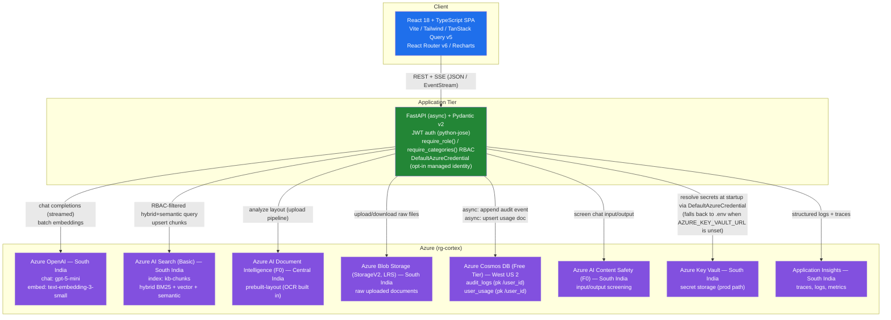

# Architecture Diagram

> **Note on tooling:** This diagram is authored as a [Mermaid](https://mermaid.js.org/) flowchart
> in a Markdown code block rather than in draw.io / Excalidraw / Lucidchart. Mermaid renders
> natively in GitHub, GitLab, Azure DevOps wikis, and most Markdown previewers, which makes it a
> pragmatic, version-controlled substitute for a static diagramming tool — no exported image to go
> stale, and it's diffable in code review. If a polished vector diagram is needed for a slide deck
> later, this graph is the source of truth to redraw from.

## System Flowchart

## Legend

| Shape / Style | Meaning |
|---|---|
| Blue box (`FE`) | Client-side React SPA — the only tier the end user's browser talks to. |
| Green box (`BE`) | FastAPI application tier — single entry point enforcing auth, RBAC, and orchestrating every Azure call. |
| Purple boxes | The 8 provisioned Azure resources inside resource group `rg-cortex`. |
| Solid arrow | A real, exercised runtime call. The Key Vault edge is real but conditional: it only fires when `AZURE_KEY_VAULT_URL` is set (production), resolving each secret via `DefaultAzureCredential`; with it unset (local dev), `Settings` reads `.env` directly and never calls Key Vault at all — see README "Azure Provisioning Guide". |
| Region label in each Azure box | The actual Azure region that resource is deployed in — most services sit in **South India**, except **Document Intelligence** (Central India, `FormRecognizer` kind unsupported in South India) and **Cosmos DB** (West US 2, free-tier capacity fallback after repeated `ServiceUnavailable` errors in South India / East US). See README § Azure Provisioning Guide for the full rationale. |

## Request-flow notes (not shown as separate arrows above, for readability)

- **Document ingestion:** `FE → BE → BLOB (store raw file) → DOCINTEL (prebuilt-layout) → BE (heading-based / sliding-window chunking) → AOAI (embeddings) → SEARCH (index upsert)`. The audit event (`document_upload`) and any errors are written to Cosmos as a background task after the response is returned.
- **Chat:** `FE → BE → CONTENTSAFETY (screen input) → SEARCH (RBAC-filtered hybrid+semantic top-5) → AOAI (streamed completion, SSE) → CONTENTSAFETY (screen output) → FE (citations + usage in final SSE event)`. The `chat_query` audit event and the `user_usage` token/cost aggregation are both written to Cosmos as background tasks after the stream completes, which is why the West US 2 round trip for Cosmos does not add latency to the user-facing chat stream.
